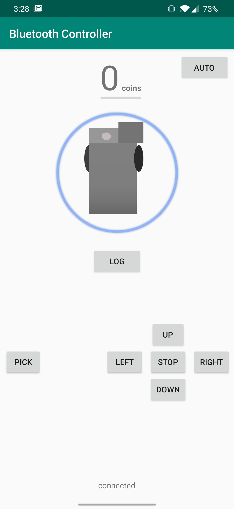
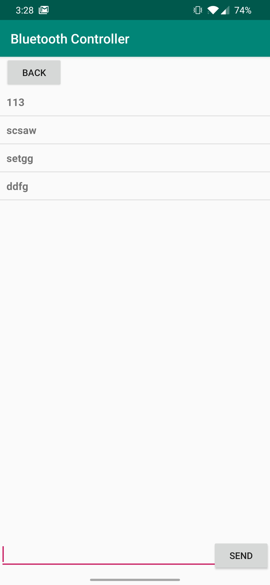

# bluetoothController
Controls a robot via bluetooth

## Features 

 * Control the robot
 * Count the amount of coins picked up
 * Detects when the vehicle is turning
 * Send commands over serial

 ## Screenshots

 

 

